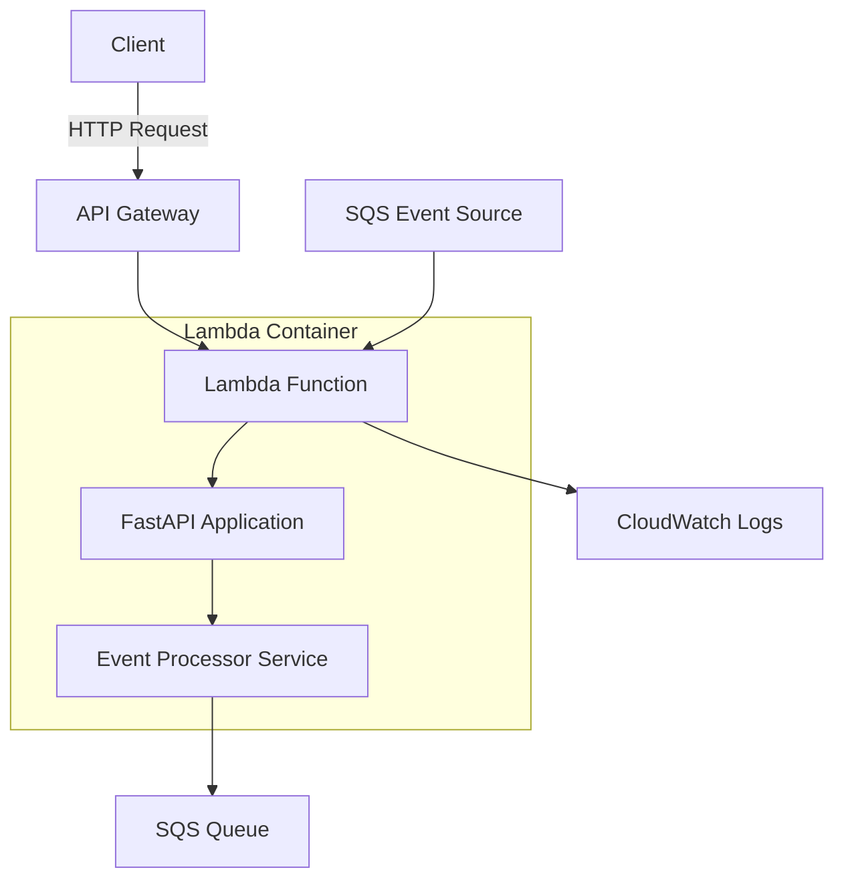

# Audio Extraction Service

A serverless audio extraction service built with AWS Lambda Web Adapter, Python FastAPI, and SQS integration. This service provides a robust, scalable platform for processing audio extraction jobs asynchronously using AWS cloud infrastructure.

## 🚀 Features

- **🎵 SQS Event Processing**: Asynchronous processing of audio extraction jobs via Amazon SQS
- **⚡ Serverless Architecture**: Built on AWS Lambda with automatic scaling and cost optimization
- **🌐 REST API**: Clean, versioned REST API with comprehensive validation
- **📊 Structured Logging**: Configurable logging with proper levels and structured output
- **🔒 Type Safety**: Full type hints with Pydantic validation for request/response models
- **🧪 Comprehensive Testing**: Unit and integration tests with pytest
- **🐳 Container Ready**: Docker containerization with multi-stage builds
- **📝 OpenAPI Documentation**: Auto-generated API documentation with FastAPI

## 🏗️ Architecture



### Components

- **AWS Lambda Web Adapter**: Enables running standard web applications on Lambda
- **FastAPI**: Modern, high-performance Python web framework
- **Amazon SQS**: Message queue for asynchronous job processing
- **Docker**: Containerized deployment using Lambda container images
- **Pydantic**: Data validation and serialization

## 📁 Project Structure

```
audio-extraction-service/
├── 📄 template.yml              # SAM template for AWS infrastructure
├── 📄 README.md                 # Project documentation
├── 🔧 .gitignore               # Git ignore patterns
│
└── 📁 service/                  # Main service directory
    ├── 🐳 Dockerfile            # Multi-stage container build
    ├── ⚙️ pyproject.toml        # Python project configuration
    ├── 🔒 uv.lock               # Dependency lock file
    ├── 📋 .env.example          # Environment variables template
    ├── 🐳 .dockerignore         # Docker ignore patterns
    ├── 🐍 .python-version       # Python version specification
    │
    ├── 📁 app/                  # Application source code
    │   ├── 🚀 main.py           # FastAPI application entry point
    │   ├── ⚠️ exceptions.py     # Custom exception definitions
    │   │
    │   ├── 📁 core/             # Core application configuration
    │   │   └── ⚙️ config.py     # Settings and configuration management
    │   │
    │   ├── 📁 api/              # API layer
    │   │   └── 📁 v1/           # API version 1
    │   │       ├── 🔀 router.py # Main API router
    │   │       └── 📁 routes/   # Route handlers
    │   │           ├── 🎵 events.py    # Event processing endpoints
    │   │           └── ❤️ health.py    # Health check endpoints
    │   │
    │   ├── 📁 schemas/          # Pydantic data models
    │   │   ├── 📨 sqs.py        # SQS event structure models
    │   │   ├── 🎵 events.py     # Event processing models
    │   │   └── ❤️ health.py     # Health check models
    │   │
    │   ├── 📁 services/         # Business logic layer
    │   │   └── ⚙️ event_processor.py  # Core event processing service
    │   │
    │   └── 📁 utils/            # Utility functions
    │       └── 📝 logging.py    # Logging configuration and utilities
    │
    └── 📁 tests/                # Test suite
        ├── ⚙️ conftest.py       # Pytest configuration and fixtures
        ├── ❤️ test_health.py    # Health endpoint tests
        ├── 🎵 test_events.py    # Event processing tests
        └── 🔧 test_services.py  # Service layer tests
```

## 🌐 API Endpoints

### Base Routes

| Method | Endpoint | Description |
|--------|----------|-------------|
| `GET`  | `/`      | Service information and status |

### Health Check

| Method | Endpoint | Description | Response Model |
|--------|----------|-------------|----------------|
| `GET`  | `/api/v1/health/` | Service health check | `HealthCheckResponse` |

**Response Example:**
```json
{
  "status": "healthy",
  "version": "0.1.0",
  "environment": "production"
}
```

### Event Processing

| Method | Endpoint | Description | Request Model | Response Model |
|--------|----------|-------------|---------------|----------------|
| `POST` | `/api/v1/events/` | Process SQS events | `SQSEvent` | `EventProcessingResponse` |

**Request Example:**
```json
{
  "Records": [
    {
      "messageId": "uuid-string",
      "receiptHandle": "receipt-handle",
      "body": "{\"job_id\":\"123\",\"file_url\":\"https://example.com/audio.mp4\"}",
      "attributes": {
        "ApproximateReceiveCount": "1",
        "SentTimestamp": "1640995200000",
        "SenderId": "sender-id",
        "ApproximateFirstReceiveTimestamp": "1640995200000"
      },
      "messageAttributes": {},
      "md5OfBody": "md5-hash",
      "eventSource": "aws:sqs",
      "eventSourceARN": "arn:aws:sqs:region:account:queue-name",
      "awsRegion": "us-east-1"
    }
  ]
}
```

**Response Example:**
```json
{
  "status": "success",
  "processed_count": 1,
  "records": [
    {
      "messageId": "uuid-string",
      "processed": true,
      "body_length": 45,
      "source": "arn:aws:sqs:region:account:queue-name"
    }
  ]
}
```

## 🔗 SQS Integration

The service uses Amazon SQS for asynchronous job processing with the following workflow:

1. **Event Trigger**: Lambda is triggered by SQS messages via Event Source Mapping
2. **Batch Processing**: Multiple SQS records are processed in a single Lambda invocation
3. **Error Handling**: Failed records are logged and marked as unprocessed
4. **Scalability**: Lambda automatically scales based on queue depth

### Message Format

Your audio extraction jobs should be sent to the SQS queue with the following structure in the message body:

```json
{
  "job_id": "unique-job-identifier",
  "file_url": "https://example.com/audio-file.mp4",
  "output_format": "mp3",
  "quality": "high",
  "callback_url": "https://webhook.example.com/callback",
  "timestamp": "2024-01-01T12:00:00Z"
}
```

## 🚀 Deployment

### Prerequisites

- [AWS CLI](https://aws.amazon.com/cli/) configured with appropriate permissions
- [AWS SAM CLI](https://docs.aws.amazon.com/serverless-application-model/latest/developerguide/install-sam-cli.html) installed
- [Docker](https://www.docker.com/) installed and running

### AWS Permissions Required

Your AWS user/role needs the following permissions:
- `lambda:*` (for Lambda function management)
- `iam:CreateRole`, `iam:AttachRolePolicy` (for execution role)
- `apigateway:*` (for API Gateway)
- `sqs:*` (for SQS queue access)
- `cloudformation:*` (for SAM deployments)

### Deployment Steps

1. **Build the application**:
   ```bash
   sam build
   ```

2. **Deploy to AWS** (first time):
   ```bash
   sam deploy --guided
   ```

3. **Deploy updates** (subsequent deployments):
   ```bash
   sam deploy
   ```

### Configuration Parameters

During guided deployment, you'll configure:

| Parameter | Description | Example |
|-----------|-------------|---------|
| Stack name | CloudFormation stack name | `audio-extraction-service-dev` |
| AWS Region | Deployment region | `us-east-1` |
| Function Name | Lambda function name | `audio-extraction-service-dev` |
| IAM Role | Execution role ARN | `arn:aws:iam::123456789012:role/lambda-role` |
| SQS Queue | Queue ARN for event source | `arn:aws:sqs:us-east-1:123456789012:queue-name` |

### Expected Outputs

After successful deployment:

| Output | Description | Example |
|--------|-------------|---------|
| **API Gateway URL** | Service endpoint | `https://abc123.execute-api.us-east-1.amazonaws.com/Prod/` |
| **Lambda Function** | Function name | `audio-extraction-service-dev` |
| **CloudWatch Logs** | Log group | `/aws/lambda/audio-extraction-service-dev` |

## 💻 Local Development

### Quick Start

1. **Clone and navigate to the service directory**:
   ```bash
   cd service
   ```

2. **Install dependencies using uv** (recommended):
   ```bash
   # Install uv if you haven't already
   pip install uv
   
   # Install all dependencies including dev dependencies
   uv sync
   ```

   Or using pip:
   ```bash
   pip install -e ".[dev]"
   ```

3. **Set up environment variables**:
   ```bash
   cp .env.example .env
   # Edit .env with your configuration
   ```

4. **Run the application**:
   ```bash
   # Using uv (recommended)
   uv run fastapi dev app/main.py --port 8080
   
   # Or using fastapi CLI directly
   fastapi dev app/main.py --port 8080
   
   # Or using uvicorn
   uvicorn app.main:app --reload --port 8080
   ```

5. **Access the application**:
   - **Service Info**: http://localhost:8080
   - **API Documentation**: http://localhost:8080/docs
   - **Alternative API Docs**: http://localhost:8080/redoc
   - **Health Check**: http://localhost:8080/api/v1/health/

### Environment Variables

Create a `.env` file based on `.env.example`:

| Variable | Description | Default | Required |
|----------|-------------|---------|----------|
| `APP_NAME` | Application display name | `"Audio Extraction Service"` | No |
| `APP_VERSION` | Application version | `"0.1.0"` | No |
| `DEBUG` | Enable debug mode | `false` | No |
| `ENVIRONMENT` | Environment identifier | `development` | No |
| `HOST` | Server bind address | `0.0.0.0` | No |
| `PORT` | Server port | `8080` | No |
| `LOG_LEVEL` | Logging level | `INFO` | No |

### 🐳 Docker Development

1. **Build the image**:
   ```bash
   cd service
   docker build -t audio-extraction-service .
   ```

2. **Run the container**:
   ```bash
   docker run -p 8080:8080 --env-file .env audio-extraction-service
   ```

3. **Run with environment variables**:
   ```bash
   docker run -p 8080:8080 \
     -e DEBUG=true \
     -e LOG_LEVEL=DEBUG \
     audio-extraction-service
   ```

## 🧪 Testing

### Running Tests

```bash
# Run all tests
uv run pytest

# Run with coverage
uv run pytest --cov=app

# Run specific test files
uv run pytest tests/test_health.py

# Run with verbose output
uv run pytest -v

# Run integration tests only
uv run pytest -m integration
```

### Test Structure

- **`test_health.py`**: Health endpoint functionality
- **`test_events.py`**: Event processing API tests
- **`test_services.py`**: Business logic unit tests
- **`conftest.py`**: Shared test fixtures and configuration

### Test Categories

Tests are marked with categories:
- `integration`: End-to-end integration tests
- `slow`: Tests that take longer to run

Run specific categories:
```bash
# Run only integration tests
uv run pytest -m integration

# Skip slow tests
uv run pytest -m "not slow"
```

## 🏭 Production Considerations

### Logging

The application uses structured logging with:
- **Configurable levels**: DEBUG, INFO, WARNING, ERROR, CRITICAL
- **Structured output**: JSON format for easy parsing
- **Request correlation**: Track requests across services
- **CloudWatch integration**: Automatic log aggregation in AWS

### Monitoring

Consider implementing:
- **CloudWatch Alarms**: Monitor error rates and latency
- **X-Ray Tracing**: Distributed tracing for debugging
- **Custom Metrics**: Business-specific metrics
- **Health Checks**: Automated health monitoring

### Security

- **IAM Roles**: Use least-privilege access principles
- **VPC Configuration**: Deploy in private subnets if required
- **Secrets Management**: Use AWS Secrets Manager for sensitive data
- **Input Validation**: Comprehensive request validation with Pydantic

### Scaling

- **Lambda Concurrency**: Configure reserved/provisioned concurrency
- **SQS Configuration**: Tune visibility timeout and batch size
- **Dead Letter Queues**: Handle failed messages appropriately
- **Cost Optimization**: Monitor and optimize memory/timeout settings

## 🛠️ Development Tools

### Code Quality

- **Type Checking**: Python 3.13+ with full type hints
- **Linting**: Configure with tools like `ruff` or `pylint`
- **Formatting**: Use `black` or `ruff format`
- **Testing**: Comprehensive test suite with `pytest`

### Dependency Management

This project uses `uv` for fast, reliable dependency management:
- **Lock file**: `uv.lock` ensures reproducible builds
- **Virtual environments**: Automatic virtual environment management
- **Fast installs**: Parallel dependency resolution and installation

## 🤝 Contributing

1. **Fork the repository**
2. **Create a feature branch**: `git checkout -b feature/amazing-feature`
3. **Make your changes and add tests**
4. **Run the test suite**: `uv run pytest`
5. **Commit your changes**: `git commit -m 'Add amazing feature'`
6. **Push to the branch**: `git push origin feature/amazing-feature`
7. **Open a Pull Request**

### Development Guidelines

- **Write tests** for new functionality
- **Update documentation** for API changes
- **Follow type hints** for all functions
- **Use conventional commits** for clear history
- **Test locally** before pushing

## 📜 License

This project is licensed under the MIT License. See the LICENSE file for details.

## 🆘 Support

For questions and support:

1. **Check the documentation** above
2. **Review existing issues** in the repository
3. **Create a new issue** with detailed information
4. **Include logs and error messages** when reporting bugs

---

**Note**: This service currently includes a simulation of audio processing logic. Replace the `_simulate_audio_processing` method in `EventProcessorService` with your actual audio extraction implementation. 